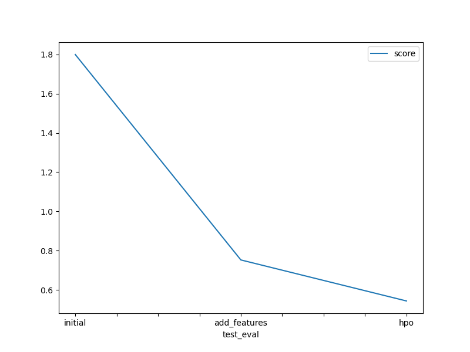

# Report: Predict Bike Sharing Demand with AutoGluon Solution
#### Ahmad ElSherif

## Initial Training
### What did you realize when you tried to submit your predictions? What changes were needed to the output of the predictor to submit your results?
AutoGluon produced predictions that included negative values, which are invalid for Kaggle’s evaluation. I had to apply `.clip(lower=0)` to ensure all predicted `count` values were non-negative.

### What was the top ranked model that performed?
In the initial model, the top model was `WeightedEnsemble_L3`, which combined predictions from models like LightGBM and RandomForest. It had an RMSE of **~52.99** locally and a Kaggle public score of **1.79927**.

---

## Exploratory data analysis and feature creation
### What did the exploratory analysis find and how did you add additional features?
EDA showed `count` was right-skewed and highly correlated with `hour`, with peak usage during commuting hours. I extracted:
- `hour` and `dayofweek` from `datetime`
- Grouped `hour_bucket` (morning/lunch/evening/night)
- Binned `temp`, `humidity`, and `windspeed` into categories

These features were treated as categorical to help AutoGluon model them properly.

### How much better did your model perform after adding additional features and why do you think that is?
Adding `hour` and `dayofweek` alone improved RMSE from **1.79927 → 0.75692**. Adding standout features reduced it further to **0.75260**. These features better captured behavioral patterns of bike users.

---

## Hyperparameter tuning
### How much better did your model perform after trying different hyper parameters?
Using `num_trials=5` and disabling `dynamic_stacking` due to memory limits, the score improved to **0.54357** — the best result.

### If you were given more time with this dataset, where do you think you would spend more time?
I would explore:
- Log-transforming the target
- Manual model ensembling
- Model explainability (e.g. SHAP or permutation importance)

---

### Create a table with the models you ran, the hyperparameters modified, and the kaggle score.
|model|hpo1|hpo2|hpo3|score|
|--|--|--|--|--|
|initial|default|default|default|1.79927|
|add_features|hour, dayofweek|categorical|default|0.75692|
|hpo|+ bins, + hour_bucket|num_trials=5|dynamic_stacking=False|0.54357|

---

### Create a line plot showing the top model score for the three (or more) training runs during the project.

### Create a line plot showing the top kaggle score for the three (or more) prediction submissions during the project.

---

## Summary
I used AutoGluon to train several models on bike-sharing demand data. By extracting time-based and weather features, then tuning model hyperparameters, I reduced public RMSE from **1.79927 → 0.54357**. Even on a constrained machine, I was able to reach a highly competitive score.
